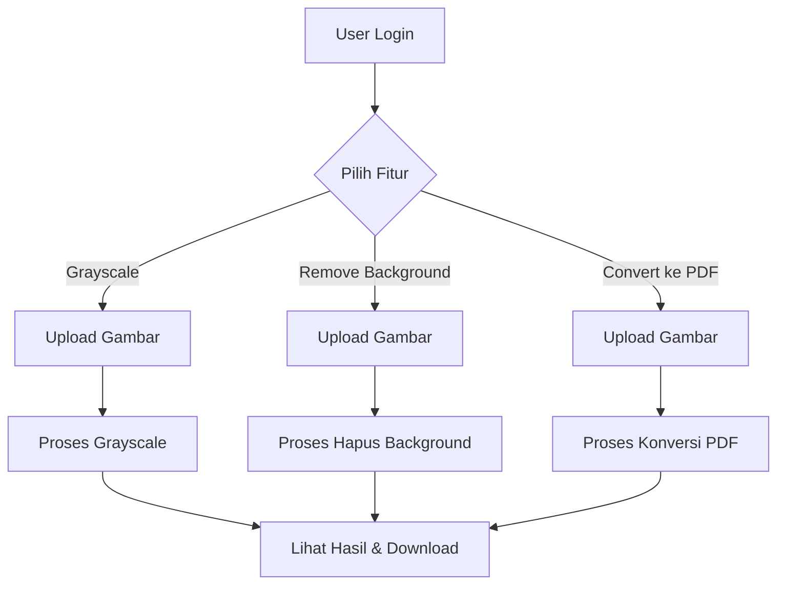

# Dokumentasi Aplikasi GreeyPix

## 1. Deskripsi Aplikasi
GreeyPix adalah aplikasi web berbasis Flask yang menyediakan tiga fitur utama:
1. Konversi gambar ke grayscale
2. Penghapusan latar belakang gambar
3. Konversi gambar ke format PDF

## 2. Diagram Alur Aplikasi
Berikut adalah diagram alur pengguna aplikasi GreeyPix:



## 3. Struktur Proyek
```
proyek-citra/
├── app.py                 # File utama aplikasi Flask
├── view/                  # Folder template HTML
│   ├── welcome.html       # Halaman utama
│   ├── add.html           # Form upload grayscale
│   ├── result.html        # Hasil grayscale
│   ├── remove_bg.html     # Form remove background
│   ├── result_remove_bg.html # Hasil remove background
│   ├── convert_pdf.html   # Form konversi PDF
│   └── result_pdf.html    # Hasil konversi PDF
├── style/                 # Folder CSS
│   ├── welcome.css
│   ├── add.css
│   ├── result.css
│   └── pdf_result.css
├── script/                # Folder JavaScript
│   ├── welcome.js
│   ├── add.js
│   ├── result.js
│   └── pdf_converter.js
└── img/                   # Folder gambar
    ├── img_upload/        # Gambar yang diupload user
    ├── img_processed/     # Gambar hasil proses
    ├── pdf_output/        # File PDF hasil konversi
    └── multi_pdf_output/  # File PDF multiple (jika ada)
```

## 4. Panduan Instalasi
1. Pastikan Python 3.x sudah terinstall
2. Install dependensi:
   ```bash
   pip install flask werkzeug opencv-python rembg img2pdf pillow
   ```
3. Jalankan aplikasi:
   ```bash
   python app.py
   ```
4. Buka browser dan akses `http://localhost:5000`

## 5. Dokumentasi API Endpoints

### 5.1. Routes Utama
- `/` - Halaman welcome dengan fitur-fitur aplikasi
- `/add_gambar` - Form upload gambar untuk konversi grayscale
- `/remove_background` - Form upload gambar untuk remove background
- `/convert_to_pdf` - Form upload gambar untuk konversi ke PDF

### 5.2. Routes Hasil Proses
- `/result_gambar` - Menampilkan hasil konversi grayscale
- `/result_remove_bg` - Menampilkan hasil remove background
- `/result_pdf` - Menampilkan hasil konversi PDF
- `/download_pdf/<filename>` - Download file PDF

### 5.3. Routes Static Files
- `/style/<path:filename>` - Mengakses file CSS
- `/script/<path:filename>` - Mengakses file JavaScript
- `/img_upload/<path:filename>` - Mengakses gambar yang diupload
- `/img_processed/<path:filename>` - Mengakses gambar hasil proses

## 6. Dokumentasi Fitur

### 6.1. Konversi Grayscale
- File: `add.html`, `result.html`, `add.css`, `add.js`
- Proses:
  1. User upload gambar melalui form
  2. Gambar diproses menggunakan OpenCV (`cv2.cvtColor(img, cv2.COLOR_BGR2GRAY)`)
  3. Hasil ditampilkan dalam format before-after

### 6.2. Remove Background
- File: `remove_bg.html`, `result_remove_bg.html`
- Proses:
  1. User upload gambar melalui form
  2. Background dihapus menggunakan library `rembg`
  3. Hasil ditampilkan dengan background transparan

### 6.3. Konversi ke PDF
- File: `convert_pdf.html`, `result_pdf.html`, `pdf_converter.js`
- Proses:
  1. User bisa upload multiple gambar
  2. Gambar dikonversi ke PDF menggunakan `img2pdf`
  3. Hasil PDF bisa didownload

## 7. Konfigurasi Aplikasi
- `UPLOAD_FOLDER`: Lokasi penyimpanan gambar upload (`img/img_upload`)
- `PROCESSED_FOLDER`: Lokasi penyimpanan gambar hasil proses (`img/img_processed`)
- `PDF_FOLDER`: Lokasi penyimpanan file PDF (`img/pdf_output`)
- `MAX_CONTENT_LENGTH`: Batas ukuran upload (16MB)

## 8. Dependensi
- Flask: Framework web
- OpenCV: Pengolahan gambar (grayscale)
- rembg: Penghapusan background
- img2pdf: Konversi gambar ke PDF
- Pillow: Manipulasi gambar

## 9. Catatan Penting
1. Pastikan folder `img` dan subfoldernya memiliki permission write
2. Untuk fitur remove background, pastikan koneksi internet tersedia pertama kali (karena perlu download model)
3. Format gambar yang didukung: PNG, JPG, JPEG

## 10. Screenshot Aplikasi
#### 1 Halaman Welcome


#### 2 Halaman Grayscale


#### 3 Hasil Grayscale


#### 4 Halaman Remove Background


#### 5 Hasil Remove Background


#### 6 Halaman PDF Conversion


#### 7 Hasil PDF Conversion


## 11. Troubleshooting
- Jika gambar tidak muncul: Periksa path folder dan permission
- Jika PDF gagal dibuat: Pastikan gambar yang diupload valid
- Jika remove background error: Coba gambar dengan background kontras tinggi


 